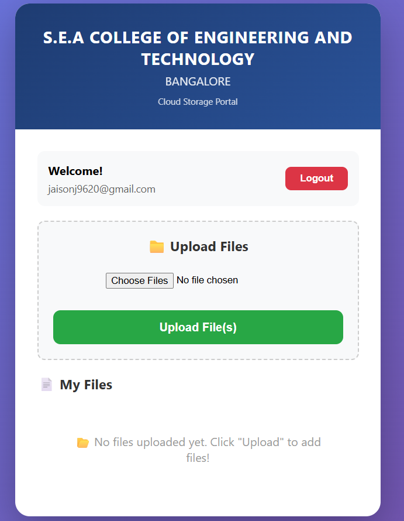
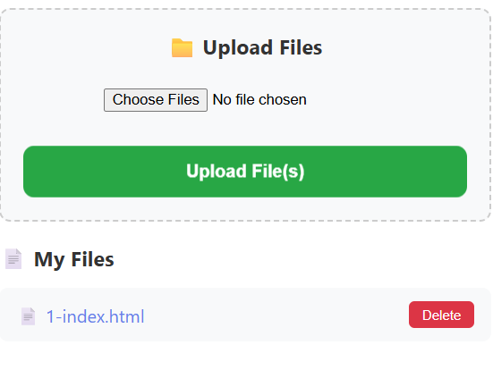

# ☁️ Cloud File Storage System (Supabase)

## 📌 Project Description
This project is a cloud-based file storage web application built using HTML, CSS, and JavaScript with Supabase as the backend. It allows users to sign up, log in, and upload files securely to cloud storage.

## 🚀 Features
- User Signup and Login (Authentication)
- File Upload to Cloud Storage
- View and Access Uploaded Files
- Simple and Clean User Interface

## 🛠️ Technologies Used
- HTML
- CSS
- JavaScript
- Supabase (Auth + Storage)

## 📂 Project Structure
cloud-storage-app/
│
├── index.html
├── app.js
├── style.css        (optional)
├── README.md
├── .gitignore
├── LICENSE
└── screenshots/
    ├── signup.png
    ├── login.png
    ├── upload.png
    ├── storage.png

## 🏗️ System Architecture
Frontend (HTML/JS) → Supabase Authentication → Supabase Storage

## 📷 Screenshots

### 🔐 Signup Page


### 🔑 Login Page


### 📤 Upload Page


### ☁️ Storage View


## ⚙️ Setup Instructions
1. Create a Supabase project
2. Enable Email Authentication
3. Create a storage bucket named `files`
4. Add storage policies (allow access)
5. Copy Project URL and Publishable Key
6. Paste them in `app.js`
7. Run using local server

## ▶️ Run Locally
```bash
python -m http.server 5500
```

## Open browser
```bash
http://localhost:5500
```
## 📌 Future Enhancements
File delete option
User-specific folders
File size validation
UI improvements

## 👨‍💻 Author
 Jaison J